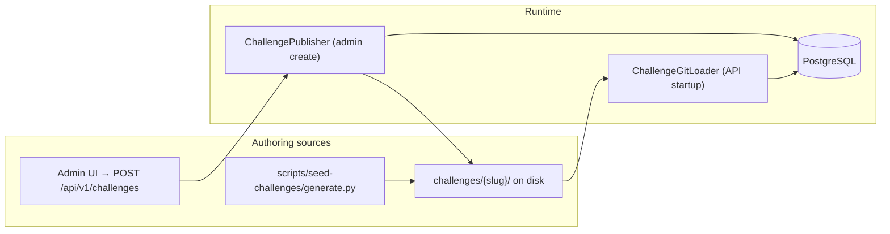

# Adding code challenges

How challenges enter the platform today, and how to extend the catalog later.

**Related:** [challenge-catalog-backlog.md](./challenge-catalog-backlog.md) · [challenge-catalog-sources.md](./challenge-catalog-sources.md) · [contracts.md](./contracts.md)

When this doc disagrees with code, **trust the code** (`ChallengeGitLoader`, `ChallengePublisher`, `scripts/seed-challenges/`).

**Catalog inspiration** (TheAlgorithms, type-challenges, app-ideas, RealWorld, etc.): [challenge-catalog-sources.md](./challenge-catalog-sources.md).

---

## How challenges are loaded



| Path | When to use |
| --- | --- |
| **Seed catalog** | Many curated problems across languages (recommended for bulk) |
| **Admin UI** | One-off custom challenge (`/challenges/new`, admin only) |
| **Manual `challenges/` tree** | Full control, new slug, matches on-disk contract |
| **Future** | AI-generated, imports, multi-file repos — see [Future authoring](#future-authoring) |

On API startup, `ChallengeGitLoader` scans `challenges/` and inserts **new** slugs into the DB. Existing slugs are not overwritten (public test metadata may sync). Restart `:be:bootRun` after adding files.

Admin **Create challenge** writes both `challenges/{slug}/` **and** DB rows in one transaction.

---

## On-disk layout

Each challenge is a directory under `challenges/`:

```text
challenges/{slug}/
├── challenge.yml          # metadata + gating
├── starter/               # learner starter file(s)
│   └── Solution.java      # name varies by language — see below
├── public/tests/          # visible in workspace (names + descriptions only via API)
│   └── …
└── hidden/tests/          # server-side only; never exposed to the browser
    └── …
```

**SQL challenges** also include `setup/schema.sql` (loaded by the PostgreSQL runner before each test).

### Starter file paths (by language)

| Language | Starter path | Test suffix | Runner layout |
| --- | --- | --- | --- |
| Java | `starter/Solution.java` | `.java` | `maven` |
| Python | `starter/solution.py` | `.py` | `pytest` |
| Go | `starter/solution.go` | `_test.go` | `go-test` |
| Node.js | `starter/solution.js` | `.test.js` | `node-test` |
| TypeScript | `starter/solution.ts` | `.test.ts` | `typescript-test` |
| C# | `starter/Solution.cs` | `.cs` | `dotnet` |
| Rust | `starter/lib.rs` | `.rs` | `cargo-test` |
| C++ | `starter/solution.cpp` | `.cpp` | `cmake-test` |
| React | `starter/solution.tsx` | `.test.tsx` | `vitest-react` |
| Vue | `starter/solution.vue` | `.test.ts` | `vitest-vue` |
| Angular | `starter/solution.ts` | `.test.ts` | `vitest-angular` |
| SQL | `starter/solution.sql` | `.py` (result checks) | `postgres-sql` |

Source of truth: `ChallengeLanguageSupport.java` and [contracts.md](./contracts.md).

---

## `challenge.yml` reference

Minimal example (Python):

```yaml
slug: count-vowels
title: Count Vowels
difficulty: easy          # easy | medium | hard (lowercase)
language: python
default_runtime_version: "3.12"
description_md: |
  Count vowels a,e,i,o,u (lowercase) in `text`.
gating_config:
  line_coverage_percent: 80
limits:
  per_test_timeout_seconds: 10
  session_duration_minutes: 30   # easy default; use 60 for medium/hard
starter_main_class: solution   # java: com.challenge.Solution
public_tests_meta:             # optional; learner-facing labels for public test names
  - name: "test_hello"
    description: 'Expect countVowels("hello") to equal 2'
  - name: "test_empty"
    description: 'Expect countVowels("") to equal 0'
```

| Field | Required | Notes |
| --- | --- | --- |
| `slug` | yes | Unique, URL-safe; directory name should match |
| `title` | yes | Display name |
| `language` | yes | One of the 11 supported languages |
| `default_runtime_version` | yes | Must match an **active** runtime in DB |
| `description_md` | yes | Problem statement (markdown/plain) |
| `difficulty` | recommended | `easy`, `medium`, `hard` |
| `gating_config` | recommended | Coverage/style thresholds; see MVP spec |
| `limits` | optional | `per_test_timeout_seconds`, `session_duration_minutes` (workspace time limit once Run/Submit starts) |
| `public_tests_meta` | optional | Maps public test names → learner-visible descriptions (use input/output phrasing; see below) |
| `starter_main_class` | Java/Python | Loader metadata for runners |

### Input / output examples (learner-facing)

Good exercises show **sample inputs and expected outputs** (like LeetCode). The workspace **Problem** panel shows an **Examples** table (from `## Examples` bullets or parseable `public_tests_meta` descriptions) and the rest of `description_md` below without duplicating that section.

**In `description_md`** (manual or seed):

```yaml
description_md: |
  Return the factorial of `n` (non-negative).

  **Examples**
  - `0` → `1`
  - `5` → `120`
```

**In `public_tests_meta`** (preferred for generated catalog):

Use descriptions the UI can parse, e.g. `Expect factorial(5) to equal 120L` or `Expect isPrime(17) to be true`. The seed script (`generate.py`) builds these from JUnit/pytest assertions and appends a **Examples** block to `description_md` automatically.

To refresh on-disk challenges after changing the catalog:

```bash
python3 scripts/seed-challenges/generate.py --force   # rewrites challenge.yml for all catalog slugs
```

To add or refresh **only** `limits.session_duration_minutes` on existing trees (30 for `easy`, 60 for `medium` / `hard`):

```bash
python3 scripts/seed-challenges/patch_session_duration.py
```

Restart the API so `ChallengeGitLoader` syncs updated `public_tests_meta`, `description_md`, and `session_duration_minutes` into Postgres.

### Rich descriptions (bulk)

`scripts/seed-challenges/challenge_enrichment.py` expands each catalog entry into sections: **What to do**, context, **Examples**, **Constraints**, and **Method to implement**. Regenerate everything:

```bash
python3 scripts/seed-challenges/generate.py --force
```

Then restart the API. See [challenge-catalog-sources.md](./challenge-catalog-sources.md#enriching-exercises-for-learners).

---

## Method 1 — Seed catalog (bulk)

Best for adding **many** problems from curated Python modules.

```bash
# From repo root
python3 scripts/seed-challenges/generate.py          # skip existing slugs
python3 scripts/seed-challenges/generate.py --force   # overwrite on-disk trees
```

| Module | Languages |
| --- | --- |
| `catalog.py` | Java, Python |
| `catalog_multi.py` | Go, Node, TypeScript, C#, Rust, C++ |
| `catalog_multi_extended.py` | +12 classic algorithms × 6 langs |
| `catalog_typescript_extra.py` | TypeScript utilities |
| `catalog_frontend.py` | React, Vue, Angular (base) |
| `catalog_frontend_extra.py` | Frontend app-ideas / examples |

**To add a new seeded challenge:**

1. Add an entry dict to the appropriate `catalog*.py` (follow existing shape: `slug`, `title`, `description`, `starter`, `public_tests`, `hidden_tests`, …).
2. Run `generate.py` (without `--force` first).
3. Restart the API so `ChallengeGitLoader` picks up new slugs.
4. Open `/challenges/{slug}` and run tests locally (`make runners` required).

Inspiration sources: [challenge-catalog-sources.md](./challenge-catalog-sources.md).

---

## Method 2 — Admin UI

Admins can create a challenge at **`/challenges/new`** (also linked from the challenges list).

- Writes `challenges/{slug}/` via `ChallengePublisher`
- Persists DB entity + public/hidden tests
- Supports all 11 languages with form templates for starter/tests
- Requires at least one public and one hidden test payload

API: `POST /api/v1/challenges` (admin role). Request shape: `CreateChallengeRequest` in the backend.

After create, the challenge appears immediately in the list; no restart needed.

---

## Method 3 — Manual git tree

For full control without the seed scripts:

1. Create `challenges/my-slug/` with `challenge.yml`, `starter/`, `public/tests/`, `hidden/tests/`.
2. Match naming conventions in the table above.
3. Ensure hidden tests cover edge cases not shown in public tests.
4. Restart API (or deploy) so `ChallengeGitLoader` imports the slug.
5. Verify: `./gradlew :be:check`, run in workspace UI, confirm runner image exists (`make runners`).

**Do not** change an existing slug’s on-disk layout in production without a migration plan — loader skips existing slugs.

---

## Future authoring

Planned or natural extensions (not all implemented yet). Use this section when designing new challenges or features.

### New single-file exercises

| Approach | Effort | Notes |
| --- | --- | --- |
| Seed catalog entry | Low | Preferred for DSA / utility / UI widget drills |
| Admin UI | Low | Good for one-offs and experiments |
| Manual tree | Medium | When seed shape doesn’t fit |

### New languages or runtimes

1. Add runner under `runners/{lang}/` + Docker image + `make runners` target.
2. Extend `WorkspaceLayout` / `ChallengeLanguageSupport` in `be/`.
3. Register language + runtime rows (Flyway/seed SQL or admin tooling).
4. Add `LANG_CONFIG` in `scripts/seed-challenges/generate.py`.
5. Update [contracts.md](./contracts.md) and this doc.

### TypeScript type-only challenges

Inspired by [type-challenges](https://github.com/type-challenges/type-challenges). Needs compile-only checker in the TypeScript runner (see [challenge-catalog-backlog.md](./challenge-catalog-backlog.md)).

### Multi-file / project-based challenges

Full mini-repos (e.g. [project-based-learning](https://github.com/practical-tutorials/project-based-learning), layered C# / eShop-style modules). Requires:

- Extended workspace layout in runner (multiple starter files)
- Workspace UI support for file tabs (today: single solution + optional custom tests)
- Larger Docker context and timeout budgets

### Frontend depth

| Idea | Status |
| --- | --- |
| React/Vue/Angular component tests (Vitest) | Supported via frontend catalog |
| Angular `TestBed` component tests | Backlog — heavier runner |
| [greatfrontend](https://github.com/greatfrontend/greatfrontend-projects) widgets | Backlog — data table, modal, etc. |

### AI-generated challenges

MVP spec includes AI-generated challenges (BYO API key). When implemented:

- Generated content should still land in `challenges/{slug}/` or via `ChallengePublisher` for reviewability.
- Human review before merge: tests must run green in CI with stub solution failing and reference solution passing.

### Import from external repos

Possible workflow:

1. Script converts external repo → `challenges/{slug}/` layout.
2. PR review + `generate.py`-style validation.
3. CI runs a subset of runners against reference solutions.

---

## Checklist before publishing

- [ ] Unique `slug`; title and difficulty set
- [ ] Starter compiles/runs (throws TODO or fails tests, not syntax errors)
- [ ] ≥1 public test (learner sees names/descriptions)
- [ ] ≥1 hidden test (edge cases)
- [ ] `default_runtime_version` is active for that language
- [ ] Coverage/style gates achievable with a reference solution
- [ ] Runner image built locally (`make runners`) or pulled in prod
- [ ] Workspace page loads at `/challenges/{slug}` ([frontend.md](./frontend.md))

---

## Verify locally

```bash
make runners                                    # once per machine / Dockerfile change
docker compose -f docker-compose.local.yml up -d  # Postgres + RabbitMQ
./gradlew :be:bootRun
cd fe && npm run dev
```

Open `http://localhost:5173/challenges/{slug}`, run tests, check bottom output tabs (tests, compiler, analysis, feedback).

Optional: run seed + loader cycle:

```bash
python3 scripts/seed-challenges/generate.py
# restart API, then exercise the new slug in the browser
```

---

## Updating an existing challenge

| Goal | Approach |
| --- | --- |
| Change description only | Edit `challenge.yml` + DB row (or re-seed with `--force` and manual DB sync) |
| Change starter/tests on disk | `--force` regenerate, or edit files; **existing slugs are not re-imported** by loader — may need DB/admin update |
| Replace entirely | New slug recommended; deprecate old slug in catalog |

For production, prefer **new slug** over mutating live challenges learners may have in progress.
