# Code Training Lab — MVP Technical Specification

> Open-source, self-hosted, multi-language code challenge and evaluation platform. Users clone the repo, supply their own AI API keys, and run it locally or on their own VPS. No SaaS, no organizations, no billing.

---

## 0. Baseline decisions

These are the locked product/technical choices. Everything in the rest of the spec follows from this table — if a later section contradicts row 0, **row 0 wins**.

| # | Decision | Choice |
| --- | --- | --- |
| 1 | Audience | **Solo learners**, self-hosted, open-source |
| 2 | Commercial model | **None** — operator brings their own API key, accepts their own costs |
| 3 | Auth | **Email + password** (BCrypt) |
| 4 | Multi-tenant / orgs | **No** — single-user model, no `organization_id` |
| 5 | Languages (Phase 1) | **All 5** — Java, Python, Node, C#, Go |
| 6 | IntelliSense | **Full LSP for all 5** (JDT, Pyright, tsserver, OmniSharp, gopls) |
| 7 | Deployment target | **Coolify on a single VPS** |
| 8 | Sandbox | **Plain Docker** + limits (CPU, mem, no-net, non-root, read-only FS, PIDs, output cap) |
| 9 | Static analysis per submission | **Tests + coverage + one linter per language** |
| 10 | AI features | **Explain failures**, **AI-generated alternatives on demand**, **AI-generated challenges** |
| 11 | AI provider | **OpenRouter default**, **Ollama alternative**, behind a provider-agnostic port |
| 12 | AI quotas | **None in code** — BYO key, operator manages provider limits |
| 13 | Database | **PostgreSQL 17** |
| 14 | Queue | **RabbitMQ** (with DLQ + retry) |
| 15 | Backend JDK | **Java 26** now, plan migration to **next LTS** when released |
| 16 | Live feedback transport | **SSE** (`GET /submissions/{id}/events`) |
| 17 | Custom tests | **Saved per user × challenge** |
| 18 | Feedback scoring | **Per-category pass / warn / fail**; any `fail` blocks the submission |
| 19 | Submission shape | **Solution file + optional custom-tests file** |
| 20 | Challenge authoring | **Git repo seed** + **DB SQL seeds** + **AI-generated** (no admin UI in MVP) |
| 21 | Observability | **Structured logs + Spring Actuator** (`/actuator/health`, `/actuator/metrics`) |
| 22 | License | **TBD** at release |
| 23 | Phase 1 split | **1a = full Java vertical**, **1b = add Python, Node, C#, Go** |
| 24 | Roadmap | **Phases 3 (candidate eval) and 4 (ATS) are dropped** — consumer/solo product only |
| 25 | Environment | **`.env.example`** at repo root — copy to `.env`; never commit secrets |

---

## 1. Vision

**Code Training Lab** is a multi-language code challenge and evaluation platform that:

- Executes user code **safely** in isolated Docker runners on the operator's own host
- Returns **deterministic** feedback (tests, coverage, one linter) before optional AI explanations
- Supports **multiple language versions** per challenge
- Provides a **browser editor** with IntelliSense (Monaco + LSP for all 5 languages)
- Runs **public**, **hidden**, and **user-created** tests (user tests saved per challenge)
- Tracks **progress** per learner account on the self-hosted instance
- Is **open-source and self-hosted** — anyone can fork, configure their own AI provider key, and run it

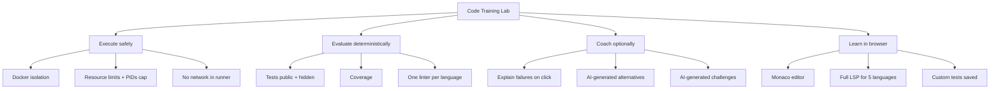

---

## 2. Technology Stack

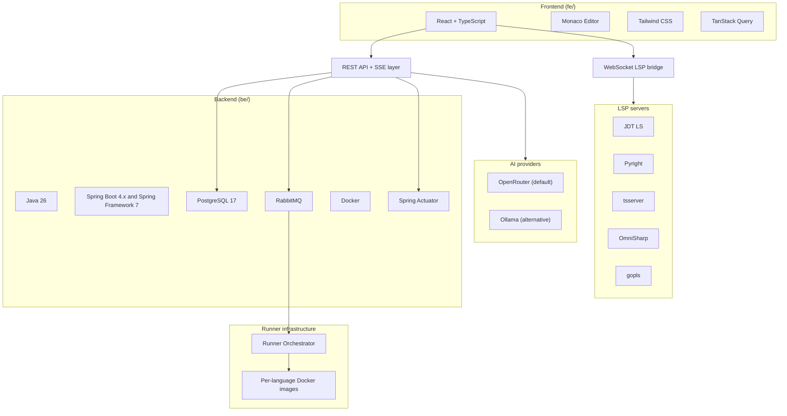

| Layer | Technologies |
| --- | --- |
| **Backend** (`be/`) | Java 26, Spring Boot 4.x, Spring Framework 7, PostgreSQL 17, RabbitMQ, Docker, Spring Actuator |
| **Frontend** (`fe/`) | React, TypeScript, Monaco Editor, Tailwind CSS, TanStack Query |
| **Runners** | Isolated Docker images per language/version |
| **LSP** | Hosted JDT LS, Pyright, tsserver, OmniSharp, gopls behind a WebSocket bridge |
| **AI** | OpenRouter (default), Ollama (alternative) via provider-agnostic port |
| **Build** | **Gradle** (Groovy DSL), multi-project root + `be` + `fe` subprojects |

### 2.1 Repository layout (`be/` and `fe/`)

Work is split into two top-level modules. Backend and frontend code do not share a single `src/` tree.

```text
code-challenge-ide/
├── settings.gradle           # include 'be', 'fe'
├── build.gradle              # root conventions, shared tasks
├── gradlew / gradlew.bat
├── gradle/
├── .java-version             # 26 — platform JDK for be/
├── .env.example              # Environment contract (copy → .env)
├── docker-compose.yml        # Pulls GHCR images (no build:)
├── .github/workflows/build.yml
├── .github/workflows/ci.yml
├── config/quality-gates.properties
├── be/                       # Backend — Spring Boot API, runners integration
│   ├── build.gradle
│   └── src/
│       ├── main/java/...
│       ├── main/resources/...
│       └── test/java/...
├── fe/                       # Frontend — React IDE, Monaco, Tailwind
│   ├── build.gradle
│   └── src/
├── challenges/               # Git-seeded challenge YAML/Markdown
├── docs/
├── scripts/
└── AGENTS.md
```

| Path | Responsibility |
| --- | --- |
| **`be/`** | REST API, SSE, auth, submissions, queues, persistence, runner orchestration, feedback aggregation, AI port |
| **`fe/`** | Browser UI, Monaco editor, LSP wiring, challenge UX, API client (TanStack Query) |
| **`challenges/`** | Curated challenge files seeded into the DB at startup |

### 2.2 Build system (Gradle)

The repository is built with **Gradle** (**Groovy DSL**: `*.gradle`). Use a **multi-project** root that includes `be` and `fe`.

**Prerequisites:** Java 26 for backend work (`jenv shell 26` or `.java-version`).

| Task | Command (from repo root) |
| --- | --- |
| Full check (backend quality gates + frontend build) | `./gradlew check` |
| Backend only | `./gradlew :be:check` |
| Backend run (local API) | `./gradlew :be:bootRun` |
| Frontend only | `./gradlew :fe:build` |
| Assemble artifacts | `./gradlew build` |

Backend (`be/`) uses the Spring Boot Gradle plugin, Java toolchain **26**, and the linter wired to `check` (Checkstyle). Frontend (`fe/`) is built via Gradle tasks that drive the Node/Vite pipeline so CI and local workflows use one entry point.

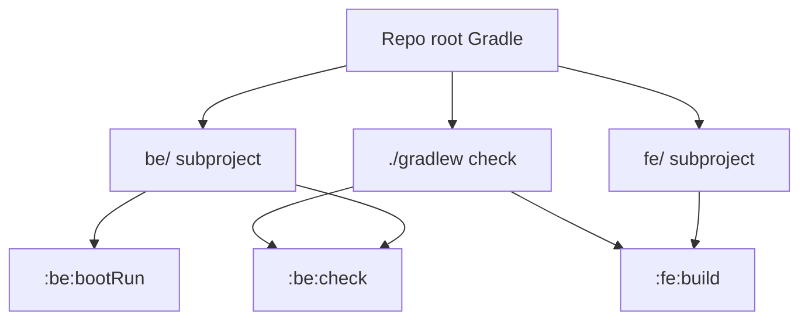

### 2.3 Environment configuration (`.env.example`)

Operators and contributors configure runtime via **`.env.example`** → **`.env`**.

| Rule | Detail |
| --- | --- |
| Template | [`.env.example`](../.env.example) — committed, no secrets, safe defaults |
| Local file | `.env` — **gitignored**, created per machine / VPS |
| Compose | `docker-compose.yml` reads `${VAR}` from `.env` automatically |
| Spring | `api` service passes env vars into the Boot container |

**Bootstrap:**

```bash
cp .env.example .env
# Edit: CTL_IMAGE_OWNER, PG_PASSWORD, RMQ_PASSWORD, OPENROUTER_API_KEY (if using AI)
docker compose pull && docker compose up -d
```

| Variable | Required | Used by | Purpose |
| --- | --- | --- | --- |
| `CTL_IMAGE_REGISTRY` | No (default `ghcr.io`) | compose `api`, `fe` | Container registry |
| `CTL_IMAGE_OWNER` | **Yes** for compose | compose `api`, `fe`, runner ref | GitHub user/org (lowercase) |
| `CTL_IMAGE_TAG` | No (default `latest`) | compose images | Image tag from CI |
| `API_PORT` / `FE_PORT` | No | compose | Host ports for API and UI |
| `PG_*` | No | `postgres`, `api` | Database credentials and name |
| `RMQ_*` | No | `rabbitmq`, `api` | Message broker credentials |
| `SPRING_PROFILES_ACTIVE` | No | `api` | Spring profile (`production` in deploy) |
| `AI_PROVIDER` | No | `api` | `openrouter` or `ollama` |
| `OPENROUTER_API_KEY` | If `AI_PROVIDER=openrouter` | `api` | BYO OpenRouter key |
| `OPENROUTER_MODEL` | No | `api` | Model id for explanations / alternatives |
| `OLLAMA_BASE_URL` | If `AI_PROVIDER=ollama` | `api` | Local Ollama endpoint |
| `OLLAMA_MODEL` | No | `api` | Ollama model name |
| `RUNNER_JAVA_26_IMAGE` | Set via compose | `api` (orchestrator) | Java 26 runner image ref |

**Security:** never commit `.env`, keys, or `docker-compose.override.yml` with secrets. Rotate `PG_PASSWORD` and `RMQ_PASSWORD` before any public deployment.

**Local dev without Docker:** use the commented JDBC/RabbitMQ lines in `.env.example` with `./gradlew :be:bootRun` and services on localhost.

---

## 3. Core MVP Features

| Feature | Description |
| --- | --- |
| Multi-language support | Java, Python, Node, C#, Go (see §4) — Java in 1a, the rest in 1b |
| Multiple language versions | Per-challenge runtime selection (e.g. Java 21 vs 25) |
| Browser editor + IntelliSense | Monaco + full LSP per language |
| Public tests | Visible test cases and results |
| Hidden tests | Platform-only tests not shown to the user |
| User-created tests | Saved per user × challenge, reloaded on next visit |
| Live submission feedback | SSE stream of progress + test results |
| Detailed feedback reports | Aggregated correctness, quality, and tooling output |
| Coverage reporting | Line/branch coverage |
| One static analyzer | Per language (Checkstyle, ruff, ESLint, Roslyn, staticcheck) |
| AI: explain a failure | User clicks "Explain"; AI explains a failed test or analyzer hit |
| AI: alternative solutions | AI generates alternatives on demand for a passed challenge |
| AI: challenge generation | Admin/operator triggers AI generation from a topic |
| Progress tracking | Per-user challenge completion state |

---

## 4. Supported Languages

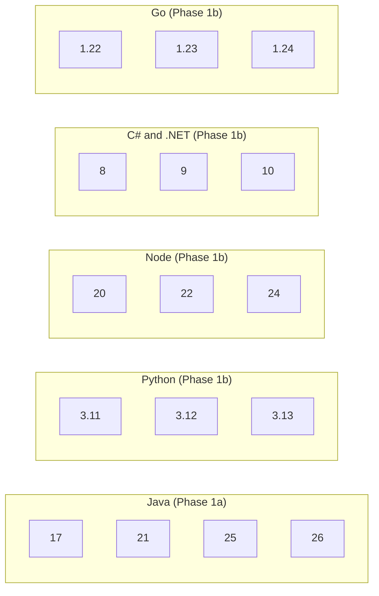

| Language | Versions | Phase |
| --- | --- | --- |
| **Java** | 25, 26 | **1a** |
| **Python** | 3.11, 3.12, 3.13 | 1b |
| **Node** | 20, 22, 24 | 1b |
| **C#** | .NET 8, 9, 10 | 1b |
| **Go** | 1.22, 1.23, 1.24 | 1b |

---

## 5. Architecture

High-level request flow from browser submission to feedback, with auth, SSE, LSP, and AI.

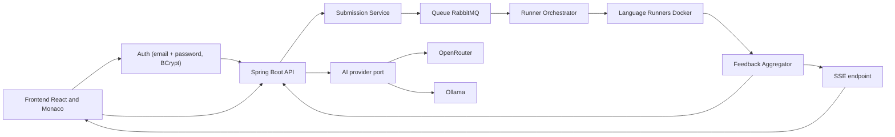

### Submission lifecycle (sequence)

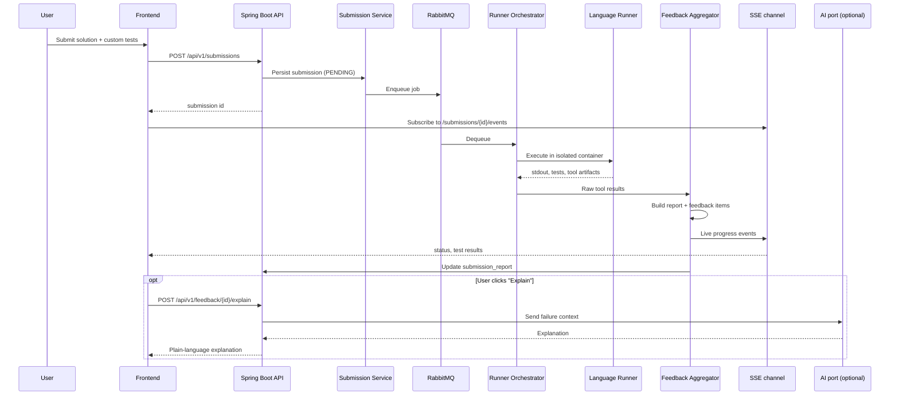

---

## 6. Runner Design

Each language/version maps to a **dedicated Docker image**. The orchestrator selects the image from `language_runtimes` configuration.

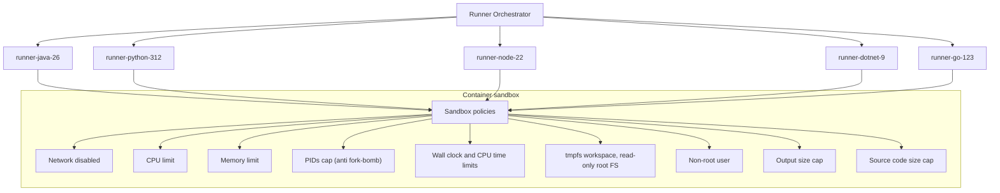

| Control | Purpose |
| --- | --- |
| Network disabled | No egress; deps fetched at image build time only |
| CPU and memory limits | Fair scheduling and abuse prevention |
| PIDs cap | Block fork-bombs |
| Wall-clock + CPU time limits | Bound runaway / infinite loops |
| tmpfs workspace + read-only root FS | Discard artifacts after run, prevent host writes |
| Non-root user | Reduce container-escape impact |
| Output size cap | Truncate runaway stdout/stderr |
| Source size cap | Reject oversized submissions early |

> **Note:** Plain Docker sandboxing only. gVisor / Firecracker are not in MVP — revisit if abuse becomes a problem.

---

## 7. IntelliSense

Browser editing uses **Monaco Editor** with **Language Server Protocol (LSP)** backends for all 5 languages, fronted by a **WebSocket bridge**.

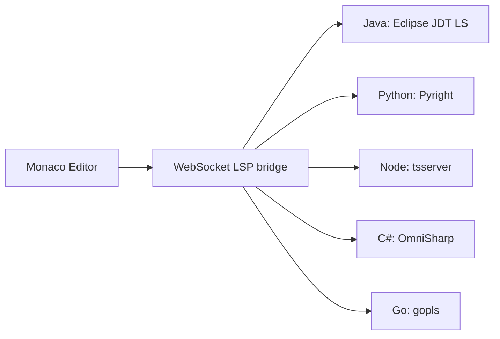

| Language | LSP server |
| --- | --- |
| Java | Eclipse JDT Language Server |
| Python | Pyright |
| Node / TypeScript | tsserver |
| C# | OmniSharp |
| Go | gopls |

LSP servers run as **stateful processes** managed by the backend (one process per active user × language, with idle timeout). This is the largest piece of operational complexity in the MVP — keep workspaces ephemeral and recycle aggressively.

---

## 8. Testing Strategy

A submission carries two buffers: the **solution file** and an optional **custom-tests file** saved per user × challenge. Hidden and platform tests are stored server-side and merged at run time.

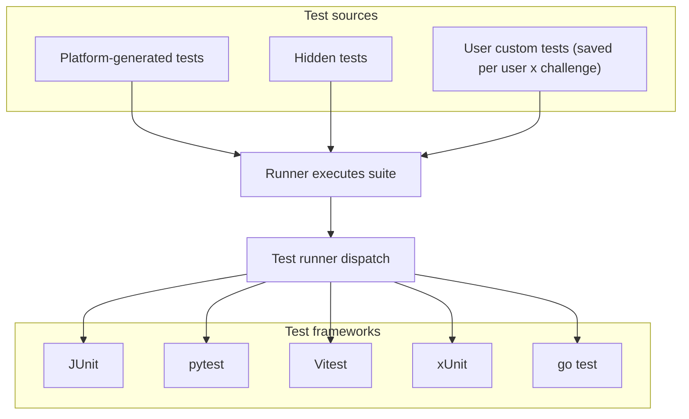

| Test type | Visibility | MVP |
| --- | --- | --- |
| Platform-generated | Public | Yes |
| Hidden | Platform only | Yes |
| User custom | Per user × challenge | Yes |
| Property-based / mutation | Varies | Out of scope |

Limits to define per language:

- Per-test timeout (defaults to 5s; configurable per challenge)
- Per-submission wall-clock budget
- Per-test stdout/stderr cap

---

## 9. Static Analysis

Deterministic tooling: **one linter per language**, plus **coverage**. Results land in `tool_results` and roll up into `feedback_items`. Heavier tools (PMD, SpotBugs, PIT, Stryker, SonarQube) are **out of MVP** — revisit when the platform is stable.

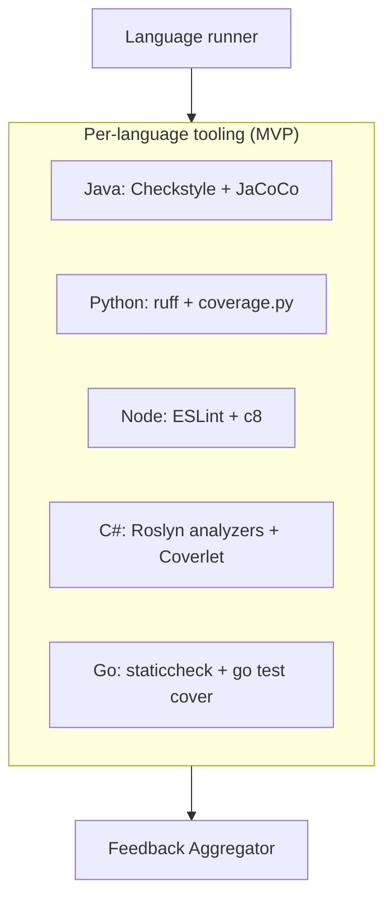

| Language | Linter (MVP) | Coverage (MVP) | Deferred |
| --- | --- | --- | --- |
| Java | Checkstyle | JaCoCo | PMD, SpotBugs, PIT, SonarQube |
| Python | ruff | coverage.py | pylint, bandit |
| Node | ESLint | c8 | Prettier, Stryker |
| C# | Roslyn analyzers | Coverlet | dotnet-format |
| Go | staticcheck | `go test -cover` | gocyclo, govulncheck |

---

## 10. Feedback Model

Reports combine multiple **feedback categories**. Each category resolves to one of: `pass`, `warn`, `fail`. **Any `fail` blocks the submission**; `warn` is informational; `pass` is required for a challenge to count as completed.

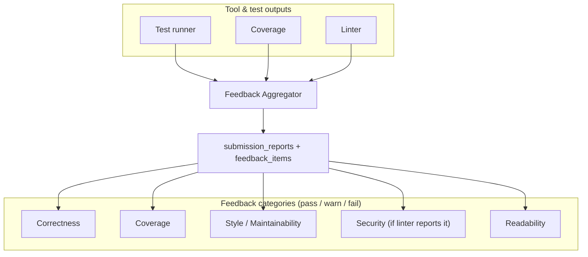

| Category | Source | Pass rule (default) |
| --- | --- | --- |
| Correctness | Public + hidden tests | All tests pass |
| Coverage | JaCoCo / coverage.py / c8 / Coverlet / `go test -cover` | ≥ challenge-defined threshold |
| Style / Maintainability | Linter | No `error`-level findings |
| Security | Linter (where it reports) | No `error`-level findings |
| Readability | Linter (style subset) | No `error`-level findings |

> Complexity, Performance, and AI-driven "Alternative Solutions" are not gating in MVP. Alternative solutions render in a separate panel.

---

## 11. APIs

All endpoints versioned under `/api/v1/`. Error responses follow **RFC 9457 Problem Details**. Auth is **email + password** issuing a signed token (JWT or opaque session cookie — pick one in implementation).

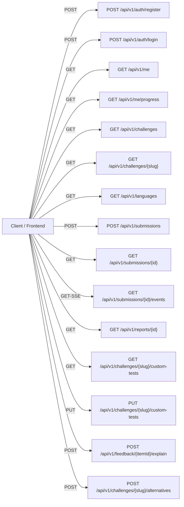

| Method | Path | Purpose |
| --- | --- | --- |
| `POST` | `/api/v1/auth/register` | Create a learner account |
| `POST` | `/api/v1/auth/login` | Issue an auth token |
| `GET` | `/api/v1/me` | Current user profile |
| `GET` | `/api/v1/me/progress` | Per-challenge completion state |
| `GET` | `/api/v1/languages` | List supported languages and versions |
| `GET` | `/api/v1/challenges` | Paginated challenge list |
| `GET` | `/api/v1/challenges/{slug}` | Challenge details + starter code |
| `POST` | `/api/v1/submissions` | Submit code (idempotency-key supported) |
| `GET` | `/api/v1/submissions/{id}` | Poll submission status |
| `GET` | `/api/v1/submissions/{id}/events` | **SSE** stream for live progress |
| `GET` | `/api/v1/reports/{id}` | Fetch aggregated feedback report |
| `GET` | `/api/v1/challenges/{slug}/custom-tests` | Load saved custom tests for this user |
| `PUT` | `/api/v1/challenges/{slug}/custom-tests` | Save / replace custom tests |
| `POST` | `/api/v1/feedback/{itemId}/explain` | Trigger AI explanation for one failure |
| `POST` | `/api/v1/challenges/{slug}/alternatives` | Trigger AI-generated alternative solution |

Operational (Actuator):

| Path | Purpose |
| --- | --- |
| `/actuator/health` | Liveness + readiness |
| `/actuator/info` | Build info |
| `/actuator/metrics` | App metrics (Prometheus-scrapable if operator wires it) |

---

## 12. Database

Core relational model (PostgreSQL 17). No `organization_id` — single-user model.

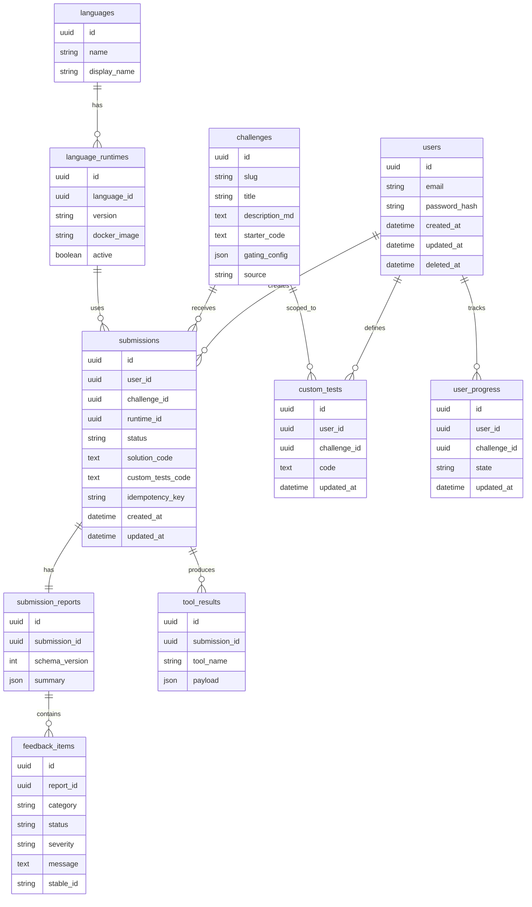

| Table | Role |
| --- | --- |
| `users` | Learner accounts, hashed password, soft delete |
| `challenges` | Problem definitions, starter code, gating config; `source` distinguishes git-seeded vs AI-generated |
| `languages` | Logical language (Java, Python, …) |
| `language_runtimes` | (language × version) → Docker image |
| `submissions` | Code runs and status; `idempotency_key` deduplicates retries |
| `submission_reports` | Aggregated report per submission, versioned by `schema_version` |
| `tool_results` | Raw analyzer/test runner output |
| `feedback_items` | Normalized feedback lines with pass/warn/fail status and stable IDs for diffing |
| `custom_tests` | One row per (user × challenge) |
| `user_progress` | Completion / attempt state |

Indexes to ship with:

- `submissions(user_id, created_at DESC)`
- `submissions(challenge_id, status)`
- `feedback_items(report_id, status)`
- `custom_tests(user_id, challenge_id)` unique
- `language_runtimes(language_id, version)` unique

---

## 13. AI Strategy

**Principle:** deterministic tooling first; AI is **optional, on demand, and BYO key**. AI errors or timeouts must **never** block the deterministic report.

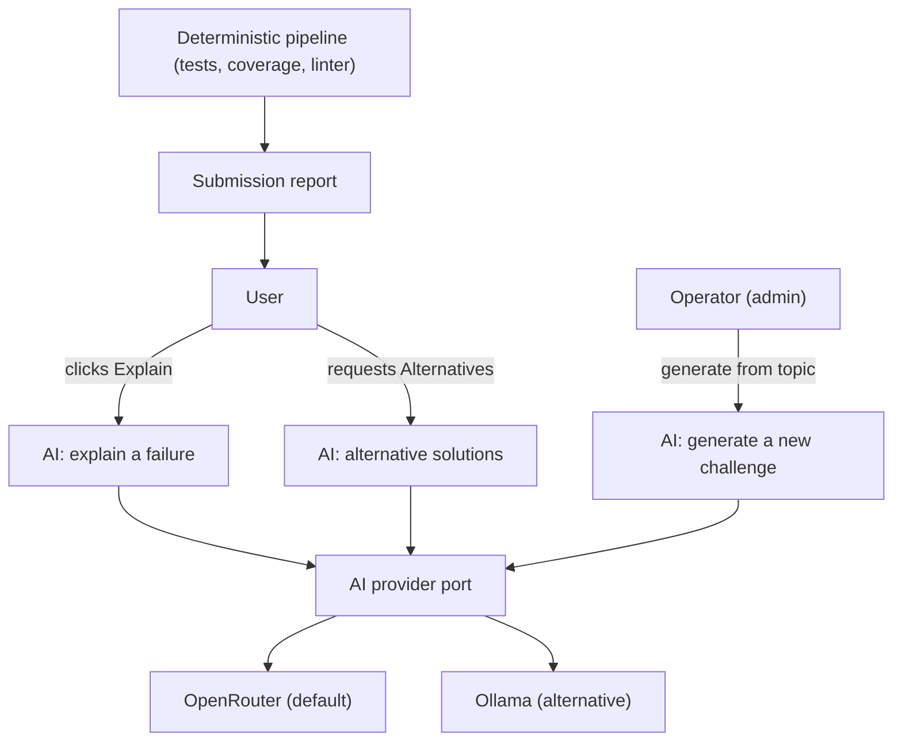

| AI job | Trigger | Input | Output |
| --- | --- | --- | --- |
| Explain a failure | User click on a failed `feedback_item` | Test stderr / assertion diff / linter line | Plain-language explanation |
| Alternative solutions | User opens "Alternatives" panel after passing | Challenge + their solution | One or more alternative approaches |
| Challenge generation | Operator/admin script | Topic + difficulty | New `challenge` row with description, starter code, hidden tests |

Configuration: copy [`.env.example`](../.env.example) to `.env` and set AI variables there (see §2.3).

**No quotas in code.** The operator is responsible for their provider's spending limits.

---

## 14. Deployment

Target: **Coolify on a single VPS** (or plain Docker Compose). The repo ships **`docker-compose.yml` that pulls pre-built images from GHCR** — it does not use `build:` contexts. Images are produced by **`.github/workflows/build.yml`** (same pattern as jobs-posting).

### 14.0 PR quality gates (required before merge)

Workflow: [`.github/workflows/ci.yml`](../.github/workflows/ci.yml)

| Check | Job | Enforces |
| --- | --- | --- |
| Backend | `backend-quality` | Tests pass; line/branch coverage ≥ thresholds in [`config/quality-gates.properties`](../config/quality-gates.properties) |
| Frontend | `frontend-quality` | ESLint + production build |

Gradle runs `:be:check`, which includes `jacocoTestCoverageVerification`. Adjust thresholds in `config/quality-gates.properties` as the codebase grows.

GitHub branch protection must require both status checks to prevent merging without a passing PR.

### 14.1 CI/CD — GitHub Actions → GHCR

Workflow: `.github/workflows/build.yml`

| Trigger | Behavior |
| --- | --- |
| Push to `main` / `master` | Build and push `:latest` + branch tag |
| Tag `v*.*.*` | Build and push semver tag |
| `workflow_dispatch` | Manual run |

| Matrix image | Dockerfile | Context |
| --- | --- | --- |
| `code-challenge-ide-pro-be` | `be/Dockerfile` | Repository root (Gradle `:be:bootJar`) |
| `code-challenge-ide-pro-fe` | `fe/Dockerfile` | `fe/` (npm build → Caddy) |
| `code-challenge-ide-pro-runner-java-26` | `runners/java/Dockerfile` | `runners/java/` |

Published as:

```text
ghcr.io/<github-owner>/code-challenge-ide-pro-be:<tag>
ghcr.io/<github-owner>/code-challenge-ide-pro-fe:<tag>
ghcr.io/<github-owner>/code-challenge-ide-pro-runner-java-26:<tag>
```

Images are signed with **cosign** on push (non-PR builds).

### 14.2 Runtime — docker compose (image-based)

Operators follow **§2.3**: copy `.env.example` → `.env`, set `CTL_IMAGE_OWNER` and secrets, then:

```bash
docker compose pull
docker compose up -d
```

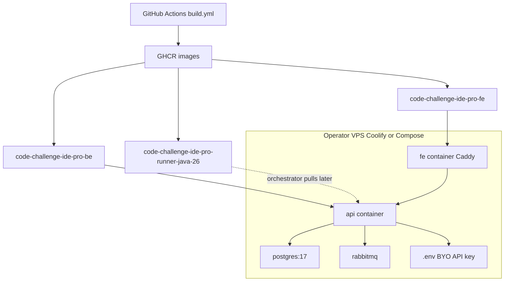

| Service | Image source |
| --- | --- |
| `api` | `${CTL_IMAGE_REGISTRY}/${CTL_IMAGE_OWNER}/code-challenge-ide-pro-be:${CTL_IMAGE_TAG}` |
| `fe` | `${CTL_IMAGE_REGISTRY}/${CTL_IMAGE_OWNER}/code-challenge-ide-pro-fe:${CTL_IMAGE_TAG}` |
| `postgres` | `postgres:17` (upstream) |
| `rabbitmq` | `rabbitmq:3-management-alpine` (upstream) |

| Concern | Approach |
| --- | --- |
| Packaging | GHCR images built in CI; compose references tags only |
| Orchestration | Coolify or `docker compose` on a single VPS |
| Secrets | `.env` on the host; `OPENROUTER_API_KEY` etc. never committed |
| Backups | Operator-owned: nightly `pg_dump` cron suggested in docs |
| Scaling | Single host. Multi-node, gVisor, K8s are deliberately out of scope |
| Observability | Structured logs + Spring Actuator endpoints |
| LSP host | Not in compose yet — add as `code-challenge-ide-pro-lsp` image in a follow-up |

---

## 15. Future Roadmap

Phase 3 (candidate evaluation) and Phase 4 (ATS integration) from the original spec are **dropped** — this is a consumer/solo product.

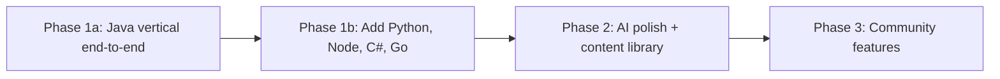

| Phase | Focus |
| --- | --- |
| **1a** | Java vertical: submission pipeline, JDT LS, Checkstyle + JaCoCo, SSE, custom tests, AI explain |
| **1b** | Add Python, Node, C#, Go (runner images, LSP servers, linters, coverage) |
| **2** | AI-generated alternatives and AI-generated challenges, challenge tagging, leaderboards (single-instance) |
| **3** | Community: shareable custom test suites, public solution gallery, themes |

---

## 16. Open-source & deployment model

- **License:** TBD at release.
- **Distribution:** Single git repo with `be/`, `fe/`, `challenges/`, `docker-compose.yml`, and **`.env.example`** (environment contract).
- **Operator responsibility:** Bring your own AI provider key (OpenRouter or Ollama). Operate Postgres backups. Watch provider spend.
- **No telemetry phoned home.** No SaaS service. No org/billing concepts in code.

---

## Appendix: Component map

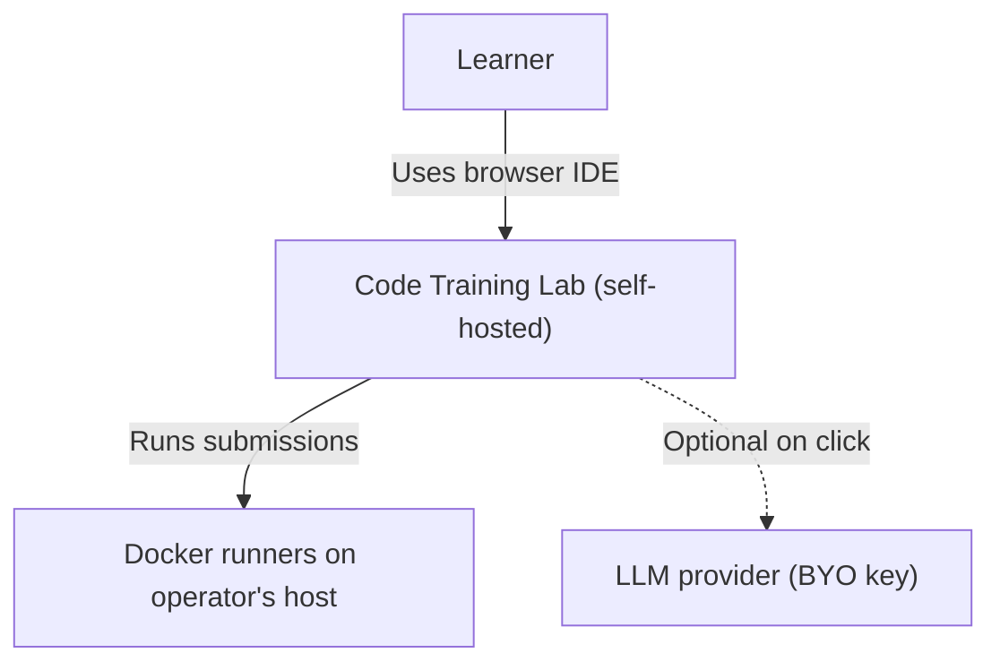

---

*Source document: `code_training_lab_mvp_specification.docx` (baseline revised 2026-05-30)*
