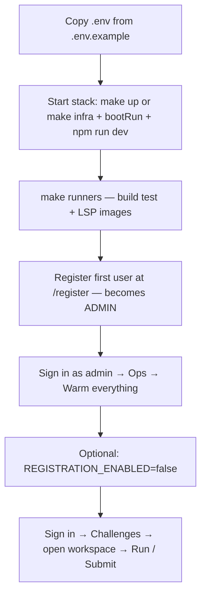

# User guide

How to use Code Training Lab end to end: first-time setup, everyday coding flows, and administrator tasks.

**Operators** (install, Docker, Make): [../README.md](../README.md)  
**Runner/LSP warm-up (technical):** [runner-ops.md](./runner-ops.md)  
**Add challenges:** [adding-challenges.md](./adding-challenges.md)

---

## Where to open the app

| Setup | Frontend | API (direct) |
| --- | --- | --- |
| Full stack in Docker (`make up`) | http://localhost:3000 | http://localhost:8080 |
| Local dev (`npm run dev` in `fe/`) | http://localhost:5173 | http://localhost:8080 (proxied as `/api` from the UI) |

Use one URL consistently for a session. Mixing ports (for example logging in on **5173** while the API only allows **5173** in CORS) can block login until origins match your `.env`.

---

## Recommended first-time flow

Complete these steps once per environment before inviting learners.



| Step | Who | Action |
| --- | --- | --- |
| 1 | Operator | Copy [.env.example](../.env.example) → `.env` (`PG_PASSWORD`, `RMQ_PASSWORD`, `JWT_SECRET` ≥ 32 chars; Linux: `DOCKER_GID` for Docker socket) |
| 2 | Operator | Start Postgres + API + UI — [README → Run locally](../README.md) |
| 3 | Operator | **`make runners`** on the Docker host (required before **Run** / **Submit** or Ops warm-up) |
| 4 | First user | **Register** at `/register` — empty DB → account becomes **`ADMIN`** |
| 5 | Admin | **Ops** (`/admin/ops`) → **Warm everything** (runners + editor LSP for all languages) |
| 6 | Admin | Set `REGISTRATION_ENABLED=false` in production if you do not want open sign-ups |
| 7 | Everyone | **Challenges** → pick a challenge → use the workspace |

Skipping **step 3** or **step 5** still lets you browse, but **Run** / **Submit** may fail or feel slow, and IntelliSense may stay cold until warm-up completes.

---

## Authentication

### Register

- Path: **`/register`** (link from `/login`).
- Password: at least **8** characters and must not equal the email.

| Situation | Result |
| --- | --- |
| **Empty database** (first account) | Role **`ADMIN`**. UI title: *“Set up administrator”*. |
| **Later sign-ups** | Role **`USER`**, only if `REGISTRATION_ENABLED=true` in `.env` (default in `.env.example`). |

**Fresh install checklist:**

```bash
cp .env.example .env
# Allow first admin + optional extra users:
REGISTRATION_ENABLED=true
```

1. Start the stack (Docker or local dev).
2. Open the app → **Register** → create admin email/password.
3. After you have an admin, set `REGISTRATION_ENABLED=false` on production hosts if sign-ups should be closed.

### Sign in

- Path: **`/login`**.
- Session uses JWT; workspace and LSP WebSockets require a valid token.

### Promote an existing user to admin

If someone registered as `USER` before bootstrap rules applied:

```sql
UPDATE users SET role = 'ADMIN' WHERE email = 'you@example.com';
```

Admins get extra navigation: **Create** (new challenge) and **Ops** (infrastructure).

### Appearance (light / dark)

Use the **sun** or **moon** icon in the top bar to switch themes. Your choice is saved in the browser and restored on the next visit. The code editor stays dark in both themes for readability.

---

## Learner flow: solve a challenge

### 1. Browse and open

1. Sign in.
2. Open **Challenges** (`/challenges`).
3. Filter by language or progress if needed.
4. Open a challenge → workspace at **`/challenges/:slug`**, or open **Metrics** in the nav for your progress summary.

### 2. Understand the workspace

| Area | Purpose |
| --- | --- |
| **Problem** (left) | Instructions, constraints, public test descriptions |
| **Editor** (center) | **Solution** tab (your code) and **Custom tests** tab (extra cases for practice) |
| **Output** (right) | **Guide** (timed challenges), **Tests**, **Compiler**, **Analysis**, **Feedback**, **History** |
| **Activity** (below editor, desktop) | Live run log stream |

**Desktop (wide screen):**

- **Hide a side panel:** use the small panel icon in the top corner of the **Problem** (left) or **Output** (right) panel.
- **Show it again:** click the same icon if the panel is only narrowed, or the **open-panel** icon on the left/right edge of the editor when fully hidden. You can also **drag** the vertical divider (highlighted bar between panels).
- **Activity log:** collapse/expand with the icon on the activity strip under the editor; drag the horizontal divider to resize.

**Mobile:** side panels are not collapsible — use **Problem | Editor | Output** tabs at the top, and **Expand** on the problem sheet for full instructions.

**Autosave:** the solution draft is stored in the browser (`localStorage`). Custom tests are saved to the server when you edit them.

### 3. Run vs Submit (important)

These buttons drive different backend paths. Use them in this order while learning:

| Action | When to use | What happens |
| --- | --- | --- |
| **Run** | While iterating | Runs tests in a **practice** run. Shows pass/fail and logs. Does **not** treat the attempt as final. Does **not** lock the editor. Does **not** produce the full AI coach report. |
| **Submit** | When you want a graded attempt | Full test run + **AI coach feedback**. On success, the exercise is **locked** until you choose **Redo**. |
| **Redo** | After a submit | Unlocks the workspace so you can edit and **Submit** again. |

**Typical loop:** edit solution → **Run** until tests pass → **Submit** for feedback → read **Feedback** tab → optional **Redo** to improve.

### Timed attempts

Many challenges have a time limit (configured per challenge, often 30 minutes for easy and 60 for harder ones).

| Topic | Behavior |
| --- | --- |
| **Before you start** | The **starter skeleton** is visible in the Solution editor (**read-only**). Read the problem and skeleton, pick a runtime, then press **Start test**. |
| **When the clock starts** | When you press **Start test** (not when you open the challenge). |
| **Countdown** | Shown in the workspace toolbar after **Start test**. |
| **Cancel run** (square while tests run) | Stops only the **current Docker run**. The session timer **keeps going**. |
| **Abandon** | Stops and **resets** the timer, exits focus mode, keeps your draft. Press **Start test** again for a **new** full limit. |
| **Redo** (after submit) | Unlocks the exercise and **resets** the timer; press **Start test** again to code. |
| **Time's up** | **Run** and **Submit** are disabled until you **Abandon** (to reset). |

### 4. IntelliSense (editor)

When the API has `CTL_LSP_ENABLED=true` and LSP images are built (`make runners`):

- Opening the workspace starts (or reuses) a **pooled LSP container per signed-in user and language** (`ctl-lsp-pool-…`).
- **Admin Ops → Warm everything** (or per-language **Warm**) preloads language servers so the first keystrokes feel faster.
- IntelliSense is **separate** from **Run** / **Submit** (those use **runner** pools, not LSP).

If completion or hovers never appear: confirm `make runners`, warm LSP on **Ops**, and that you are signed in on the same origin as the API allows in CORS.

### 5. Read results

| Output tab | Content |
| --- | --- |
| **Tests** | Assertion failures, stdout/stderr from the runner |
| **Compiler** | Build/compile errors when compilation fails |
| **Analysis** | Static analysis / coverage-style signals when the runner provides them |
| **Feedback** | AI coach narrative (especially after **Submit**) |
| **History** | Past runs for this challenge |

States you may see: loading, running, compilation error, failed test, timeout, service unavailable, successful submission — see [frontend.md](./frontend.md).

---

## Administrator flows

### Warm runners and LSP (Ops page)

Path: **`/admin/ops`** (header **Ops** when signed in as **`ADMIN`**).

**Before you click anything**

| Requirement | Why |
| --- | --- |
| API can run **`docker`** on the host | Runners and LSP spawn via `docker.sock` (Linux: `DOCKER_GID` in `.env`) |
| **`make runners`** completed | Images must exist locally |
| Signed in as **`ADMIN`** | Endpoint is restricted |

**Actions**

| Button | Use when |
| --- | --- |
| **Warm everything** | First setup or after deploy; warms submission runners **and** editor LSP for all 11 languages. Skips languages already warm for the current image ID. |
| **Re-warm everything** | After `make runners`, image tag changes, or status looks stale |
| **Warm** (per language) | You only care about one stack (e.g. Java 26 only) |

**Reading the page**

- **Banner** — progress and how many languages are fully ready.
- **Checklist** — Docker reachable, images built, at least one warm completed.
- **Language table** — **Run tests** = submission runner preload; **IntelliSense** = editor LSP preload. Expand **Technical details** for image inventory.

The page **polls every few seconds** while a job runs. Watch **Current job** for logs.

**Docker full stack:** `RUNNER_POOL_WARM_ON_STARTUP=true` in `.env` can warm on API boot; **Ops** is still the place to re-warm after `make runners` or image updates.

CLI alternatives: `make lsp-warm`, Maven warm via compose — [runner-ops.md](./runner-ops.md).

### Create a challenge

1. Sign in as admin.
2. **Create** → `/challenges/new`.
3. Fill metadata, starter code, and tests.

Other authoring paths: [adding-challenges.md](./adding-challenges.md) (bulk seed, manual `challenges/` tree).

### Manage learners

- Control open registration with `REGISTRATION_ENABLED` in `.env`.
- Promote admins via SQL (see [Authentication](#promote-an-existing-user-to-admin)).

---

## Roles at a glance

| Role | Challenges | Workspace Run/Submit | Create challenge | Ops warm-up |
| --- | --- | --- | --- | --- |
| **USER** | Browse, solve | Yes | No | No |
| **ADMIN** | Browse, solve | Yes | Yes | Yes |

---

## Troubleshooting (common user-visible issues)

| Symptom | Likely cause | What to do |
| --- | --- | --- |
| **Run** / **Submit** fails immediately | Runner images missing | Operator: `make runners`; admin: **Ops → Warm** |
| Very slow first Java run | Cold Maven cache / pool | Admin: warm Java on **Ops**; wait for Maven cache step |
| Ops shows runner **cold** but container running | Image rebuilt; stamp stale | **Re-warm everything** or per-language **Warm** |
| No IntelliSense | LSP not built/warmed or not signed in | `make runners`; **Ops** LSP warm; stay signed in |
| Login works in curl but not browser | Wrong UI port vs CORS | Use http://localhost:5173 (dev) or :3000 (Docker); align `ctl.cors` / origins in `.env` |
| Editor locked after submit | Expected after successful **Submit** | Click **Redo** to edit again |

---

## Related documentation

| Topic | Doc |
| --- | --- |
| Install, Make, Docker compose | [../README.md](../README.md) |
| Runner pools, stamps, env vars | [runner-ops.md](./runner-ops.md) |
| Workspace UI details | [frontend.md](./frontend.md) |
| Challenge contracts | [contracts.md](./contracts.md) |
| Deploy (Coolify / VPS) | [coolify.md](./coolify.md) |
